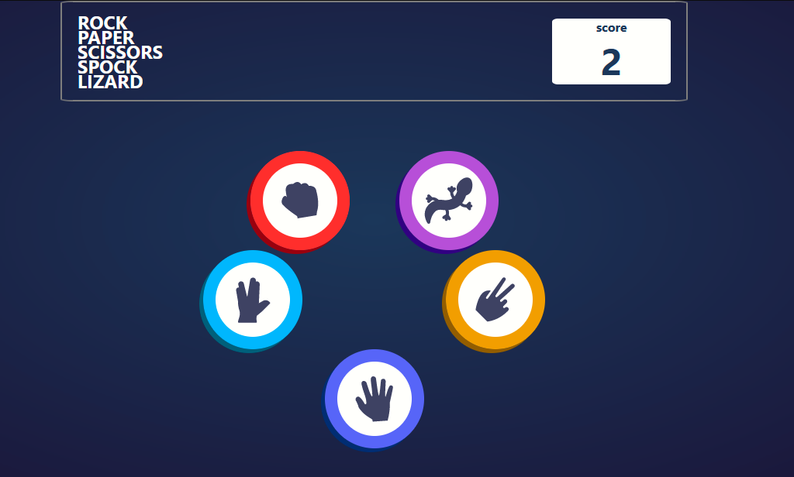

# Frontend Mentor - Rock, Paper, Scissors solution

This is a solution to the [Rock, Paper, Scissors challenge on Frontend Mentor](https://www.frontendmentor.io/challenges/rock-paper-scissors-game-pTgwgvgH). Frontend Mentor challenges help you improve your coding skills by building realistic projects.

## Table of contents

- [Overview](#overview)
  - [The challenge](#the-challenge)
  - [Screenshot](#screenshot)
  - [Links](#links)
- [My process](#my-process)
  - [Built with](#built-with)
  - [What I learned](#what-i-learned)
  - [Continued development](#continued-development)
  - [Useful resources](#useful-resources)
- [Author](#author)
- [Acknowledgments](#acknowledgments)

## Overview

### The challenge

Users should be able to:

- View the optimal layout for the game depending on their device's screen size
- Play Rock, Paper, Scissors against the computer
- Maintain the state of the score after refreshing the browser _(optional)_
- **Bonus**: Play Rock, Paper, Scissors, Lizard, Spock against the computer _(optional)_

### Screenshot

### Links

- Solution URL: [Go to Github](https://github.com/Muhammad-Zahir-Hur/Rock-Paper-Scissor-FrontendMentors-Challange)
- Live Site URL: [open now](https://muhammad-zahir-hur.github.io/Rock-Paper-Scissor-FrontendMentors-Challange/)

## My process

### Built with

- Flexbox
- [lodash](https://lodash.com/) - JS library
- [React](https://reactjs.org/) - JS library

### What I learned

- React context
  -React reducers
  -lodash functions
  -more in hands

### Continued development

I am planning to add some transition effects while updating the phases.

### Useful resources

- [Lodash](https://lodash.com) -I used this to cut the elements array in to three smaller arrays 2 of length 2, 1 of length 1, I rendered each array as a row in the App component, I did this to get stylish arrangement of the elements using flexbox in each of the rows.

## Author

- Website - [Muhammad Zahir Hur](https://muhammad-zahir-hur.github.io/Portfolio/)
- Frontend Mentor - [Muhammad Hur](https://www.frontendmentor.io/profile/Muhammad-Zahir-Hur)
- Facebook - [Muhammad Zahir](https://www.facebook.com/profile.php?id=100094515745098)

## Acknowledgments

### Shamaeel Ahmed

He was the One by whom I got inspired and decided to complete this challenge. On my way completing the challenge he help me in every moment. I talked to him about he solutions of the problems I got, he provided he his support in a sympathetic and encouraging manner. Thanking you a lot Shamaeel.
[Shamaeel Ahmed](https://github.com/ShamaeelAhmed)
